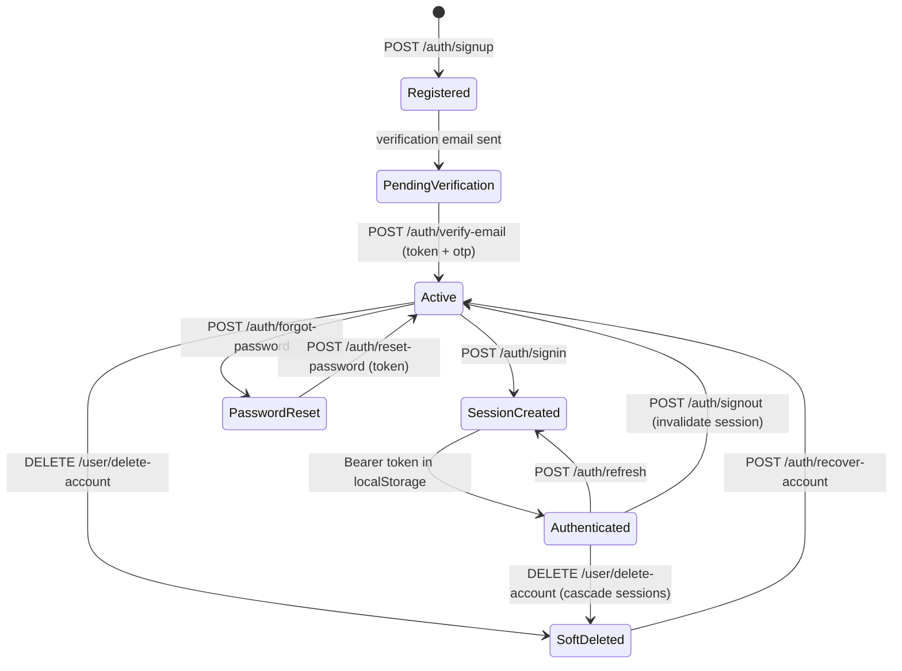
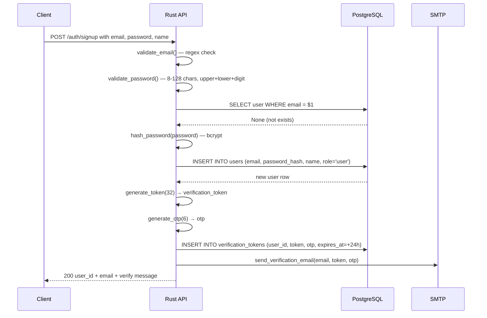
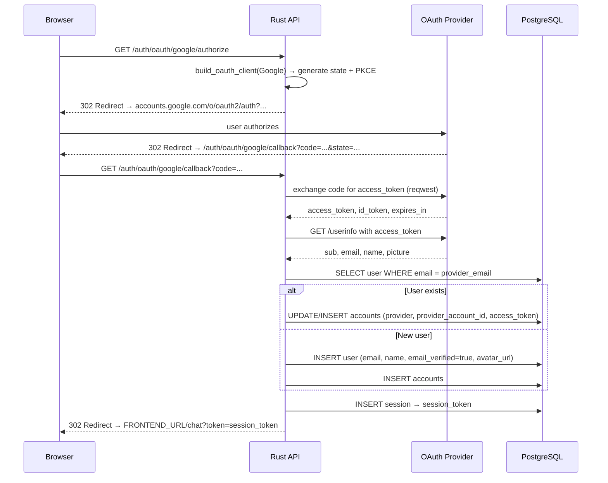

# Auth & Session Model

## Token Types

| Token | Length | Storage | Expiry | Purpose |
|-------|--------|---------|--------|---------|
| Session token | 64-char alphanumeric | `sessions.session_token` | 7 days | Bearer auth on every request |
| Verification token | 32-char alphanumeric | `verification_tokens.token` | 24 hours | Email verification link |
| OTP | 6-digit numeric | `verification_tokens.otp` | 24 hours | Email verification code |
| Password reset token | 32-char alphanumeric | `password_reset_tokens.token` | 24 hours | Password reset link |

All tokens are generated via `rand::thread_rng()` — cryptographically secure random generation.

## Auth State Lifecycle



## Signup Flow



## Password Requirements

Enforced in `common/validation.rs`:

- Minimum 8 characters, maximum 128 characters
- Must contain at least one uppercase letter
- Must contain at least one lowercase letter
- Must contain at least one digit

```rust
pub fn validate_password(password: &str) -> Result<(), ValidationError> {
    if password.len() < 8 || password.len() > 128 { return Err(...) }
    if !password.chars().any(|c| c.is_uppercase()) { return Err(...) }
    if !password.chars().any(|c| c.is_lowercase()) { return Err(...) }
    if !password.chars().any(|c| c.is_numeric()) { return Err(...) }
    Ok(())
}
```

## Session Management

**Session creation** (`auth/session.rs`):
```rust
pub async fn create_session(db: &PgPool, user_id: Uuid, role: Role, ip: Option<IpNet>, user_agent: Option<String>) -> Result<Session>
// Generates 64-char token
// INSERT INTO sessions (user_id, session_token, expires_at=NOW()+7days, role, ip_address, user_agent)
```

**Session validation** (in `auth_middleware`):
```
SELECT s.user_id, s.role FROM sessions s WHERE s.session_token = $1 AND s.expires_at > NOW()
```

**Session cleanup** (`auth/background.rs`):
```rust
pub fn start_session_cleanup_task(db: PgPool) -> tokio::task::JoinHandle<()>
// Runs in background Tokio task
// DELETE FROM sessions WHERE expires_at < NOW()
// Interval: configurable, runs indefinitely
```

## OAuth Flow



## Role Model

```rust
#[derive(sqlx::Type)]
#[sqlx(type_name = "user_role", rename_all = "lowercase")]
pub enum Role {
    User,
    Admin,
}
```

The `user_role` PostgreSQL enum has exactly two variants: `user` and `admin`. The frontend `api-types.ts` also exposes a `superadmin` variant in the `AdminContext.isAdmin` check — this is a client-side extension that does not correspond to a database value.

**Role propagation**: when a user's role changes via `PATCH /admin/users/{id}/role`, existing sessions are **not** invalidated. The session row's `role` column is **not** updated. The user must sign out and sign in again to receive new role permissions in their session.

> **Bug/weakness**: Role changes via the admin panel are not reflected in active sessions. This is an architectural inconsistency — a role downgrade takes effect only after session expiry (7 days) or explicit logout.
