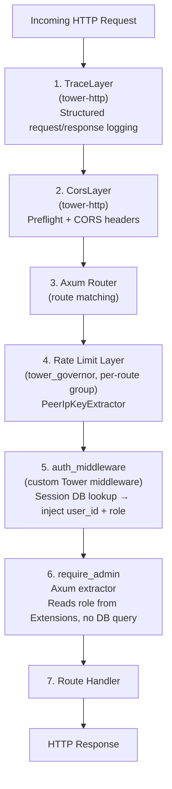

# Middleware Pipeline

## Chain Order

Every HTTP request passes through the following middleware stack in order:



**Layers 1–2** apply globally to every request.  
**Layer 4** applies per route group (separate `tower_governor` instances for `auth`, `user/chat/admin`).  
**Layer 5** applies to all routes except `/health` and `/auth`.  
**Layer 6** applies only to `/admin` routes.

## `auth_middleware`

Injected as an Axum middleware layer on the `/user`, `/chat`, and `/admin` router groups.

**Implementation**:
1. Reads `Authorization: Bearer <token>` header
2. Queries `sessions` table: `SELECT s.user_id, s.role FROM sessions s WHERE s.session_token = $1 AND s.expires_at > NOW()`
3. If found: inserts `user_id: Uuid` and `role: Role` into `Request` extensions
4. If not found or expired: returns `401 Unauthorized`

**Optimization**: Session rows store the user's `role` directly (duplicated from `users.role`). This means a **single DB query** resolves both identity and authorization level — no secondary lookup against the `users` table.

**Cost**: One DB query per authenticated request. With a `PgPool` of 10 connections and a 20-connection max overflow, this is the primary connection consumer under load.

## `require_admin`

Applied as an additional extractor on `/admin` route handlers:

```rust
pub async fn require_admin(
    Extension(role): Extension<Role>,
) -> Result<(), StatusCode> {
    match role {
        Role::Admin => Ok(()),
        _ => Err(StatusCode::FORBIDDEN),
    }
}
```

Reads `role` from the request extensions set by `auth_middleware`. **Zero database queries** — pure memory read.

## Rate Limiting

Uses `tower_governor` with `PeerIpKeyExtractor` (limits by client IP).

| Layer | Endpoints | Rate | Burst |
|-------|-----------|------|-------|
| Standard | `/auth/signin`, `/auth/signup`, OAuth endpoints | 6/s | 10 |
| Sensitive | `/auth/forgot-password`, `/auth/reset-password`, `/auth/resend-verification`, `/auth/recover-account` | ~1/20s | 3 |

**Rate limit response**: `429 Too Many Requests` with `Retry-After` header.

**Bypass risk**: `PeerIpKeyExtractor` uses the direct TCP peer IP. Behind a reverse proxy, this would always be the proxy IP unless `X-Forwarded-For` extraction is configured. This is a known attack surface — all clients behind the same proxy share a single rate limit bucket (see [Security Analysis](/security/overview)).

## CORS Configuration

Built in `config/cors.rs` via `CorsLayer`. Controlled by `CORS_ALLOWED_ORIGINS` env var:

- `*` → wildcard CORS (development mode, allows all origins)
- Comma-separated list → specific origins only

Wildcard CORS combined with `localStorage` token (rather than `httpOnly` cookies) means CORS does not provide meaningful protection against credential theft — the token is accessible to any same-origin JS.

## Tower Stack Composition

```rust
// Simplified router assembly in gateway/mod.rs
let app = Router::new()
    .nest("/health", health_router())
    .nest("/auth", auth_router().layer(rate_limit_standard))
    .nest("/user", user_router().layer(auth_layer))
    .nest("/chat", chat_router().layer(auth_layer))
    .nest("/admin", admin_router()
        .layer(require_admin_layer)
        .layer(auth_layer))
    .layer(cors_layer)
    .layer(trace_layer)
    .with_state(app_state)
```
