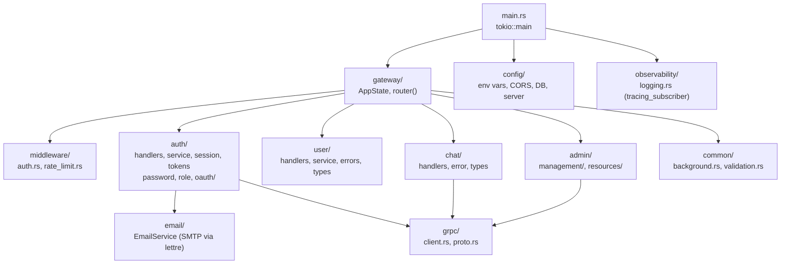

# API Service — Overview & Module Map

## Responsibilities

The Rust API service is the **sole public-facing entry point**. It handles:

- HTTP request routing and middleware (Axum + Tower)
- Authentication and session validation
- Authorization (role enforcement)
- Request proxying to the Intelligence service via gRPC
- All PostgreSQL writes for identity, sessions, and conversations
- Reading `chat_messages` written by the Intelligence service
- Static file serving via `tower-http::services::ServeDir`
- Rate limiting on auth-sensitive endpoints
- Observability via `tracing` + `TraceLayer`

## `AppState`

```rust
pub struct AppState {
    pub db: PgPool,                              // SQLx PostgreSQL connection pool
    pub config: Config,                          // Loaded from environment
    pub intelligence_client: IntelligenceClient, // tonic gRPC client wrapper
    pub start_time: std::time::Instant,          // Used for uptime calculation
}
```

`PgPool` implements `FromRef<AppState>`, allowing extractors to access it directly from state without destructuring.

## Module Structure



## Cargo Dependencies

| Category | Crate | Version | Notes |
|----------|-------|---------|-------|
| Web Framework | `axum` | 0.8.8 | Tower-compatible, type-safe extractors |
| Async Runtime | `tokio` (features: full) | 1.49.0 | Multi-threaded work-stealing scheduler |
| gRPC client | `tonic` | 0.14.2 | HTTP/2, mTLS capable |
| gRPC codegen | `prost` + `tonic-prost` | 0.14.x | Protobuf v3 codegen |
| Serialization | `serde` + `serde_json` | 1.0.x | Derive macros |
| Database | `sqlx` (postgres, uuid, chrono, macros) | 0.8.3 | Compile-time checked queries |
| IDs | `uuid` (v4, serde) | 1.19.0 | UUIDv4 generation |
| Time | `chrono` (serde) | 0.4 | Timestamps, duration |
| Password hashing | `bcrypt` | 0.15 | Argon2-equivalent, blocking |
| OAuth | `oauth2` | 4.4 | Google + GitHub flows |
| HTTP client | `reqwest` (json) | 0.12 | OAuth token exchange |
| Email | `lettre` (tokio1-rustls-tls) | 0.11 | Async SMTP |
| Rate limiting | `governor` + `tower_governor` | 0.10.4 / 0.8.0 | Token bucket, per-IP |
| Middleware | `tower` + `tower-http` | 0.5.2 / 0.6 | CORS, TraceLayer, ServeDir |
| Observability | `tracing` + `tracing-subscriber` | 0.1.41 | Structured logging |
| Streaming | `futures` + `async-stream` | 0.3 | SSE bridge macros |
| Validation | `regex` + `once_cell` | 1.10.4 | Email/password validation |
| Crypto | `sha2` | 0.10 | Token hashing |
| IP networks | `ipnetwork` | 0.21.1 | Client IP storage |
| Env | `dotenvy` | 0.15.7 | `.env` loading |
| Build | `tonic-prost-build` | 0.14.2 | `build.rs` proto compilation |

## Environment Configuration

| Variable | Default | Purpose |
|----------|---------|---------|
| `DATABASE_URL` | — | PostgreSQL connection string |
| `SERVER_HOST` | `0.0.0.0` | Bind address |
| `SERVER_PORT` | `8080` | HTTP port |
| `INTELLIGENCE_SERVICE_URL` | `http://[::1]:50051` | gRPC endpoint |
| `GOOGLE_CLIENT_ID` / `_SECRET` / `_REDIRECT_URL` | — | Google OAuth |
| `GITHUB_CLIENT_ID` / `_SECRET` / `_REDIRECT_URL` | — | GitHub OAuth |
| `SMTP_HOST` / `_PORT` / `_USERNAME` / `_PASSWORD` | — | Email delivery |
| `FROM_EMAIL` | — | Sender address |
| `FRONTEND_URL` | — | Used in email links |
| `CORS_ALLOWED_ORIGINS` | `*` | Comma-separated or `*` |
| `RUST_LOG` | `api=debug` | tracing log filter |
