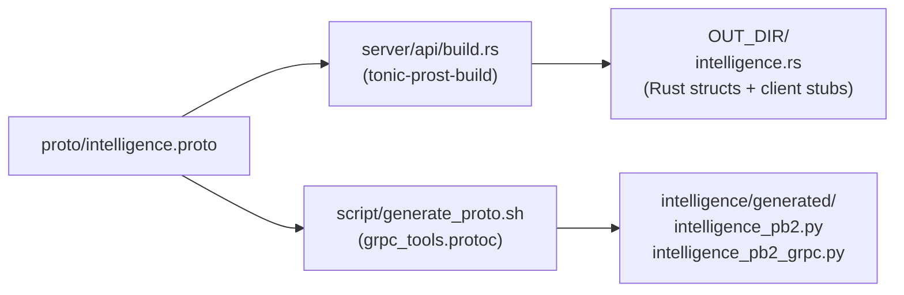

# Monorepo & Build Systems

## Client — Turborepo + Bun

The `client/` directory is a Turborepo monorepo with a single app package (`web`). The root `package.json` defines workspace configuration; `turbo.json` defines the pipeline tasks.

```
client/
├── package.json     # workspace root, turbo dependency
├── turbo.json       # pipeline: dev, build, lint, type-check
└── web/             # Next.js app package
    └── package.json # app-level deps (next, react, zustand, zod, etc.)
```

**Build commands** (from `client/` root):
- `bun run dev` — starts Next.js in development mode with Turbopack
- `bun run build` — production build via `next build`
- Turborepo caches build outputs in `.turbo/cache/`, enabling incremental rebuilds

**Key client dependencies** (from `web/package.json`):
- `next` — App Router, SSR, API proxying via `next.config.ts`
- `react` / `react-dom` — React 19 concurrent features
- `zustand` + `devtools` + `persist` middleware — client state
- `zod` — runtime schema validation for all API responses
- `sonner` — toast notifications
- `next-themes` — SSR-safe theming
- `tailwindcss` — utility CSS

## Server API — Cargo

The `server/api/` is a standard Cargo binary crate. `build.rs` compiles the Protobuf definition into Rust types at build time.

```
server/api/
├── Cargo.toml       # crate manifest + all dependencies
├── build.rs         # tonic-prost-build: compile proto/intelligence.proto
└── src/
    └── main.rs      # tokio::main entry point
```

**Build commands**:
- `cargo build --release` — produces a single static binary
- `cargo test` — runs integration tests (requires `DATABASE_URL`)
- `cargo sqlx prepare` — regenerates `.sqlx/` offline query cache

**Two-phase compilation**: `build.rs` runs `tonic_build::compile_protos("../proto/intelligence.proto")` which generates Rust structs and client stubs into `OUT_DIR`. The generated module is imported via `include!` macro in `grpc/proto.rs`.

## Intelligence Service — uv / pyproject.toml

The `server/intelligence/` service uses `uv` (ultra-fast Python package manager) with `pyproject.toml` for dependency declaration. A `.python-version` file pins the interpreter to Python 3.14.

```
server/intelligence/
├── pyproject.toml   # dependencies, dev tools (ruff, mypy, pytest)
├── .python-version  # interpreter pin (3.14)
├── pytest.ini       # test configuration
└── main.py          # entry point
```

**Build/run commands**:
- `uv sync` — install dependencies into virtual environment
- `uv run python main.py` — start gRPC server
- `uv run pytest` — run test suite

**Dev tooling**:
- `ruff` — linting and formatting (replaces black + isort + flake8)
- `mypy` — static type checking
- `pytest` + `pytest-asyncio` — async test runner

## Proto — Shared Contract

```
server/proto/
└── intelligence.proto   # package: opentier.intelligence.v1
```

The proto file is the single source of truth for the Rust↔Python interface. It is consumed by both build systems:
- **Rust**: `build.rs` → `tonic-prost-build` → generated to `OUT_DIR`
- **Python**: `grpcio-tools` → `python -m grpc_tools.protoc` → `intelligence/generated/`



Any change to `intelligence.proto` requires regenerating both sides before the services can communicate. The proto package uses `reserved` field ranges 1000–1999 (internal use) and 2000–2999 (future extensions), and follows a v1 → v2 versioning policy with a 6-month migration window for breaking changes.
