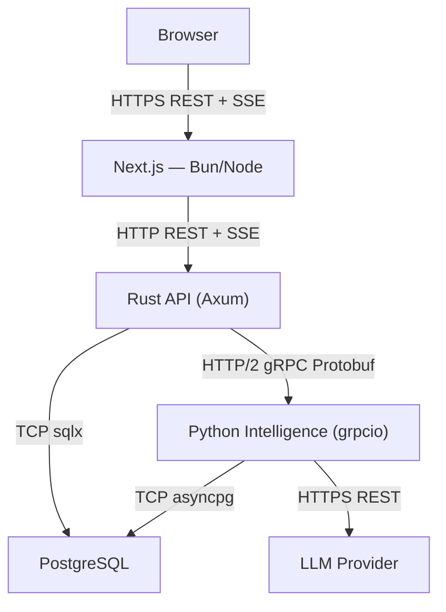
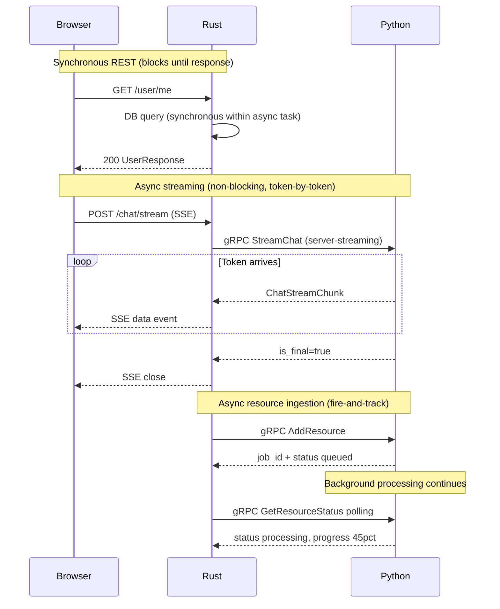
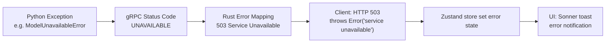

# Communication Model — Protocols & Contracts

## Protocol Layers



## REST API (Browser ↔ Rust)

All REST communication uses JSON. The Next.js proxy adds no transformation — it is a transparent passthrough to the Rust backend.

**Request format**:
- `Content-Type: application/json`
- `Authorization: Bearer <64-char session token>`

**Response format**: JSON body with appropriate HTTP status codes. Errors follow:
```json
{ "message": "Human-readable error description" }
```

**Streaming endpoint** (`POST /chat/conversations/{id}/stream`):
- Response `Content-Type: text/event-stream`
- Each SSE event: `data: <JSON ChatStreamChunk>\n\n`
- Terminal event: `data: {"is_final":true,...}\n\n`

## gRPC Contract (Rust ↔ Python)

**Package**: `opentier.intelligence.v1`  
**Transport**: HTTP/2 clear-text (development); TLS-capable via tonic feature flags  
**Message size limit**: 100 MB (both directions)  
**Keepalive**: 60 seconds

### Core Message Types

```protobuf
// Chat flow
message ChatRequest {
    string user_id = 1;
    string conversation_id = 2;
    string message = 3;
    optional ChatConfig config = 4;
    map<string, string> metadata = 5;
}

message ChatConfig {
    optional float temperature = 1;
    optional int32 max_tokens = 2;
    optional bool use_rag = 3;
    optional string model = 4;
    optional int32 context_limit = 5;
}

message ChatResponse {
    string conversation_id = 1;
    string message_id = 2;
    string response = 3;
    repeated ContextChunk sources = 4;
    optional ChatMetrics metrics = 5;
    string created_at = 6;  // ISO 8601
}

message ChatStreamChunk {
    string conversation_id = 1;
    string message_id = 2;
    oneof chunk_type {
        TokenChunk token = 3;
        SourcesChunk sources = 4;
        MetricsChunk metrics = 5;
        ErrorChunk error = 6;
    }
    bool is_final = 7;
}

// Resource ingestion
message AddResourceRequest {
    string user_id = 1;
    string resource_id = 2;
    oneof content {
        string text = 3;
        string url = 4;
        bytes file_content = 5;
    }
    ResourceType type = 6;
    optional string title = 7;
    map<string, string> metadata = 8;
    optional IngestionConfig config = 9;
    bool is_global = 10;
}
```

## Sync vs Async Communication



## Error Propagation Chain



**Error transparency**: Python exception details are **not** propagated to the browser. The gRPC status code is mapped to an HTTP status, and the Rust layer generates a generic error message. This prevents internal stack traces from leaking to clients.

## Proto Versioning Policy

| Rule | Detail |
|------|--------|
| Breaking changes | Require new package version: `v1` → `v2` |
| Migration window | 6 months both versions supported simultaneously |
| Reserved fields | 1000–1999 (internal), 2000–2999 (extensions) |
| Wire compatibility | Fields added with `optional` or `repeated` are backward compatible |
| Removal | Fields must be `reserved` for 1+ version before removal |

New fields should always be `optional` to maintain forward compatibility with older Rust clients that don't yet know how to populate them.

## SSE Bridging Pattern

The Rust `stream_chat` handler converts a gRPC server-streaming RPC into an HTTP SSE stream:

```rust
// Simplified
async fn stream_chat(State(state): State<AppState>, ...) -> Sse<impl Stream<Item=Result<Event>>> {
    let mut grpc_stream = state.intelligence_client
        .stream_chat(grpc_request)
        .await?;

    let sse_stream = async_stream::stream! {
        while let Some(chunk) = grpc_stream.message().await.transpose() {
            match chunk {
                Ok(c) => yield Ok(Event::default().data(serde_json::to_string(&c).unwrap())),
                Err(e) => {
                    yield Ok(Event::default().event("error").data(e.to_string()));
                    break;
                }
            }
        }
    };

    Sse::new(sse_stream).keep_alive(KeepAlive::default())
}
```

**Keepalive**: Axum's SSE `KeepAlive::default()` sends empty `:` comment lines every 15 seconds to prevent proxy timeouts during long-running LLM generation.
