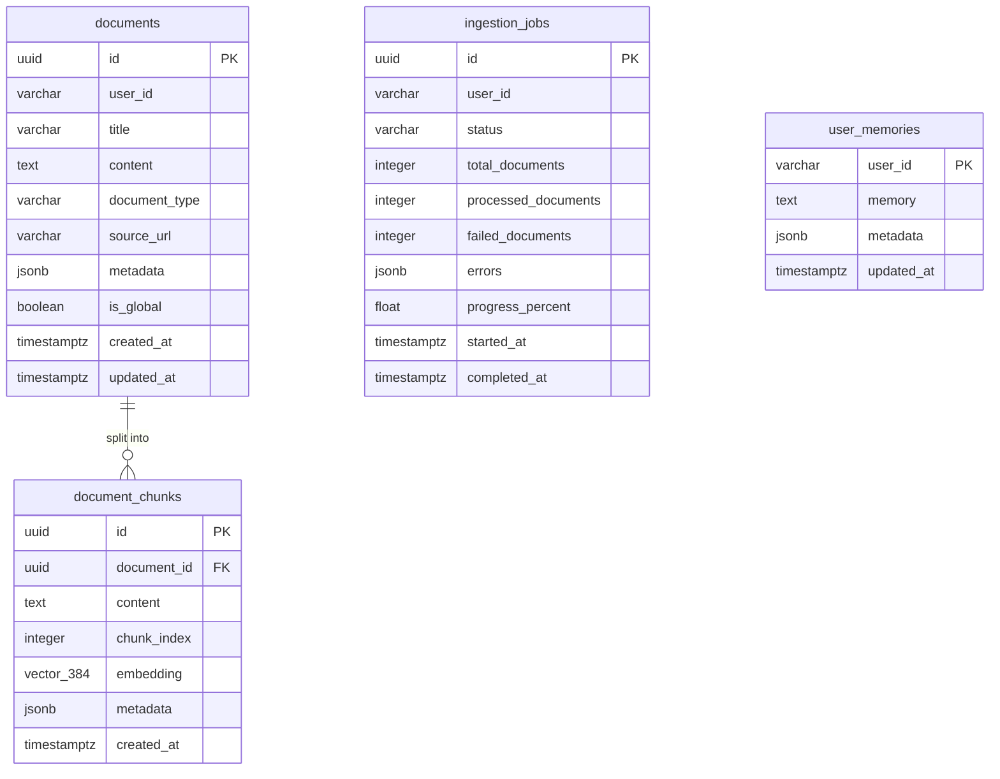
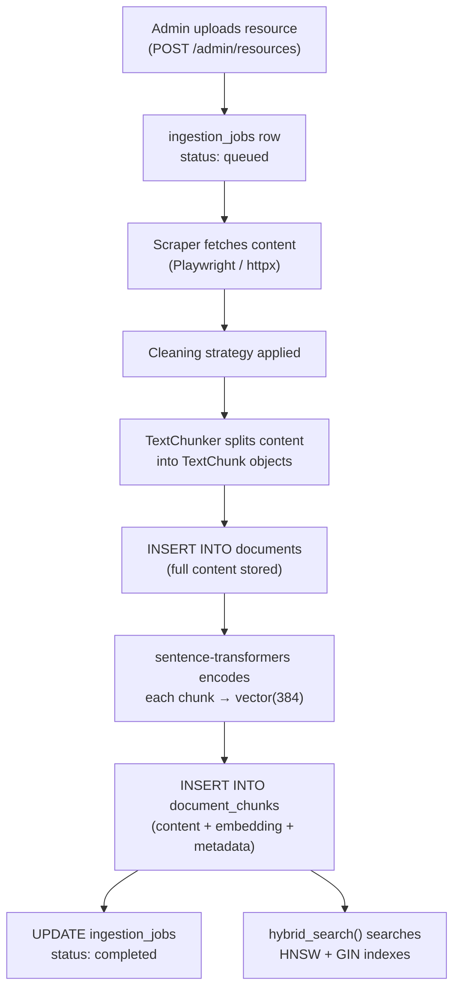

# Vector & AI Schema

## pgvector Extension

Migration `20260115000001` enables the pgvector extension:

```sql
CREATE EXTENSION IF NOT EXISTS vector;
```

This adds the `vector(n)` data type, enabling storage of fixed-dimension floating-point vectors with cosine, L2, and inner product distance operators.

## Document Storage Model



## `documents` Table

| Column | Notes |
|--------|-------|
| `user_id` | VARCHAR — matches `conversations.user_id` pattern; not a FK to `users` |
| `document_type` | `text`, `markdown`, `html`, `pdf`, `code` |
| `is_global` | When `true`, visible to all users in `hybrid_search()` |
| `content` | Full raw content (pre-chunking); stored for source retrieval |
| `metadata` | JSONB — arbitrary key-value (URL, author, language, etc.) |

**Indexes**:
- `idx_documents_user_id`
- `idx_documents_is_global`
- `idx_documents_created_at DESC`

## `document_chunks` Table

| Column | Notes |
|--------|-------|
| `embedding` | `vector(384)` — MiniLM output, L2-normalized |
| `chunk_index` | Sequential order within the parent document |
| `metadata` | JSONB — inherits document metadata + chunk-specific data (start_char, end_char) |

**Indexes**:
```sql
-- HNSW vector index for approximate nearest neighbor search
CREATE INDEX ON document_chunks
USING hnsw (embedding vector_cosine_ops)
WITH (m = 16, ef_construction = 64);

-- GIN index for full-text search
CREATE INDEX ON document_chunks
USING gin(to_tsvector('english', content));
```

**HNSW memory estimate**: Each vector node stores `384 * 4 bytes = 1536 bytes` of float data, plus ~`m * 8 bytes = 128 bytes` for links. With 1 million chunks: ~1.6 GB for the HNSW index in RAM.

## `ingestion_jobs` Table

Tracks the lifecycle of each resource ingestion operation:

| Status | Meaning |
|--------|---------|
| `queued` | Job created, not started |
| `processing` | Actively processing documents |
| `completed` | All documents processed successfully |
| `failed` | All documents failed |
| `partial` | Some documents succeeded, some failed |

`errors` is a JSONB array of error objects: `[{ "document": "...", "error": "...", "timestamp": "..." }]`

**Progress tracking**: `progress_percent = (processed_documents + failed_documents) / total_documents * 100`

## `user_memories` Table

```sql
CREATE TABLE user_memories (
    user_id VARCHAR(255) PRIMARY KEY,  -- one row per user, UPSERT pattern
    memory TEXT NOT NULL DEFAULT '',   -- free-text persistent context
    metadata JSONB NOT NULL DEFAULT '{}',
    updated_at TIMESTAMPTZ NOT NULL DEFAULT NOW()
);
```

**UPSERT pattern**: The Intelligence service uses `INSERT ... ON CONFLICT (user_id) DO UPDATE SET memory = ..., updated_at = NOW()` to maintain the single-row-per-user invariant.

**Memory growth**: The `memory` column is unbounded TEXT. Without periodic truncation or summarization, it will grow indefinitely. There is no eviction or archiving mechanism defined.

## Data Lifecycle



## Consistency Risks

1. **`conversations.user_id` is VARCHAR**: No FK constraint to `users.id`. If a user is hard-deleted from the admin panel, their conversations remain orphaned (no cascade). Python can still read/write them.

2. **Dual migration management**: If the Rust and Python migration scripts are run out of order, `chat_messages` or `documents` may be created before `conversations` exists (FK dependency). Scripts should be coordinated.

3. **Partial ingestion**: A crash during step 7–9 (after `INSERT INTO documents` but before chunks are committed) leaves a document row with no chunks. The `ingestion_jobs.errors` records this, but no automatic cleanup occurs.

4. **HNSW index rebuild**: Adding bulk chunks to `document_chunks` doesn't trigger an index rebuild — the HNSW index is maintained incrementally. Under heavy insert load, query recall may degrade until `REINDEX` is run.
