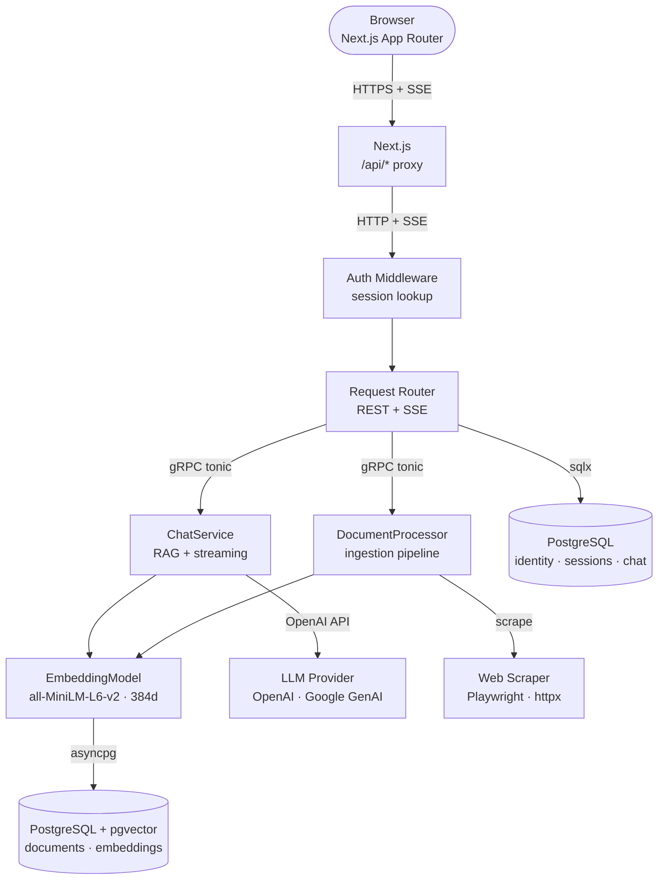

# OpenTier Architecture

OpenTier is a production-oriented AI platform built around RAG (Retrieval-Augmented Generation) with web scraping capabilities. The system is designed around a hard architectural principle:

> **Rust owns the public gateway. Python owns all intelligence. gRPC is the only permitted bridge.**

This boundary is not a convention — it is enforced at the process level. No Python code is callable from the Rust API except through the Protobuf contract defined in `proto/intelligence.proto`.

## Technology Stack

| Layer | Technology | Runtime |
|-------|-----------|---------|
| Frontend | Next.js 16 (App Router), React 19, Zustand, Zod | V8 (Bun/Node) |
| API Gateway | Rust / Axum 0.8, Tokio 1.49, SQLx 0.8 | Native |
| Intelligence Engine | Python 3.14, gRPC / grpcio, SQLAlchemy 2.0 | CPython |
| Vector Database | PostgreSQL + pgvector extension | Postgres |
| Embeddings | `sentence-transformers/all-MiniLM-L6-v2` (384 dims) | CPU/CUDA |
| LLM | OpenAI-compatible (default: `gpt-4o`) / Google GenAI | Remote API |
| IPC | gRPC over HTTP/2, Protobuf v3 | OS network |
| Auth | Session tokens (64-char random), OAuth2 (Google, GitHub) | — |
| Streaming | SSE (browser ↔ Rust), gRPC server-streaming (Rust ↔ Python) | — |

## System Topology

## Guiding Design Decisions

1. **Single shared PostgreSQL instance** — the `conversations` table is written by Rust and read by Python. The `chat_messages` table is written exclusively by Python; Rust reads it via `get_conversation`. This creates a coupling point that is intentional — it avoids a separate inter-service message store.

2. **No token service** — auth uses opaque session tokens stored in PostgreSQL. There is no JWT or token signing infrastructure. This simplifies revocation (DELETE row) at the cost of a DB lookup on every authenticated request.

3. **SSE over WebSockets** — streaming chat uses Server-Sent Events. Rust bridges gRPC server-streaming to an SSE `EventStream`. This avoids WebSocket state management while enabling token-by-token streaming.

4. **Eager gRPC connection with lazy fallback** — the Rust API attempts to connect to the Intelligence service at startup. On failure, it falls back to `connect_lazy()` and continues booting. This avoids a hard coupling between service startup order.

5. **Session role caching** — user role is stored in the `sessions` table row (duplicated from `users.role`). The auth middleware resolves both `user_id` and `role` in a **single DB query**, eliminating a second `users` table lookup on every request.
