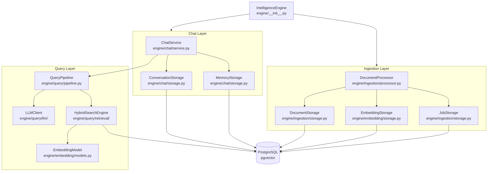
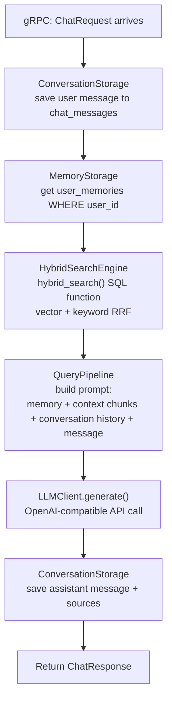

# Engine Architecture

## `IntelligenceEngine` — Composition Root

```python
class IntelligenceEngine:
    def __init__(self):
        self.llm_client = LLMClient()
        self.query_pipeline = QueryPipeline(llm_client=self.llm_client)
        self.chat_service = ChatService(self.query_pipeline)
```



## `ChatService` (`engine/chat/service.py`)

Orchestrates a full chat turn:

```python
async def send_message(
    user_id: str,
    conversation_id: str,
    message: str,
    metadata: dict = {},
    config: ChatConfig = None
) -> ChatResponse:
    conversation = await ConversationStorage.get_or_create(conversation_id, user_id)
    await ConversationStorage.save_message(role="user", content=message, parent_id=config.parent_id)
    memory = await MemoryStorage.get_user_memory(user_id)
    response: QueryResponse = await self.query_pipeline.run(
        query=message,
        user_id=user_id,
        conversation_id=conversation_id,
        memory=memory,
        config=config
    )
    await ConversationStorage.save_message(role="assistant", content=response.response, sources=response.sources)
    return ChatResponse(response=response.response, sources=response.sources, metrics=response.metrics)
```

`stream_chat` is the same flow but returns an `AsyncGenerator[ChatStreamChunk]` — the LLM call is replaced with a streaming call, and each token is immediately yielded.

## Stream Error Code Mapping

The `ChatService` maps Python exceptions to gRPC stream error chunk types:

| Exception | `ChatStreamChunk.error_code` |
|-----------|------------------------------|
| `TimeoutError` | `TIMEOUT` |
| `RateLimitError` | `RATE_LIMITED` |
| `ContextTooLongError` | `CONTEXT_TOO_LONG` |
| `ModelUnavailableError` | `MODEL_UNAVAILABLE` |
| `ValidationError` | `INVALID_REQUEST` |
| All others | `INTERNAL_ERROR` |

Error chunks are sent as a terminal `ChatStreamChunk` with `is_final=True` before the stream closes.

## `QueryPipeline` (`engine/query/pipeline.py`)

```python
class QueryPipeline:
    def __init__(
        self,
        llm_client: LLMClient,
        top_k: int = 5,
        max_context_length: int = 2000,
        vector_weight: float = 0.7,
        keyword_weight: float = 0.3,
    )

    async def run(query, user_id, conversation_id, memory, config) -> QueryResponse:
        context: QueryContext = await self.retrieve_context(query, user_id)
        optimized_context = self._optimize_context(context, max_context_length)
        response = await self.llm_client.generate(
            query=query,
            context=optimized_context,
            memory=memory,
            config=config
        )
        return QueryResponse(response=response, context=context, sources=context.chunks)
```

`QueryContext`:
```python
@dataclass
class QueryContext:
    chunks: List[SearchResult]     # top_k results from hybrid search
    context_text: str              # concatenated chunk content
    total_chunks: int
    avg_similarity: float
```

`QueryResponse`:
```python
@dataclass
class QueryResponse:
    response: str
    context: QueryContext
    sources: List[SearchResult]
    metrics: Optional[ChatMetrics]
```

## Internal Data Flow — Non-Streaming


