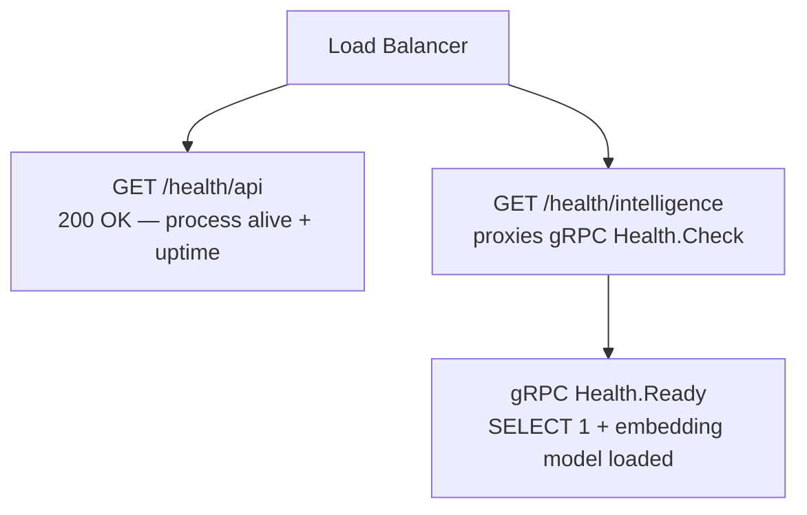
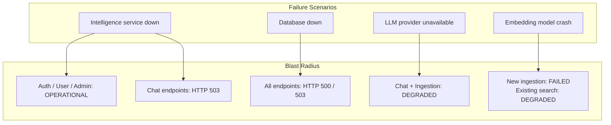

# Observability & Reliability

## Rust API Logging

**Framework**: `tracing` + `tracing-subscriber`

Initialized in `observability/logging.rs`:

```rust
tracing_subscriber::registry()
    .with(EnvFilter::new(
        std::env::var("RUST_LOG").unwrap_or_else(|_| "api=debug".into())
    ))
    .with(tracing_subscriber::fmt::layer())
    .init();
```

**Default filter**: `api=debug` — logs all messages from the `api` crate at DEBUG level, other crates at WARN.

**Request tracing**: `TraceLayer` from `tower-http` automatically emits structured span events for every request:
- On request: method, path, version
- On response: status code, duration
- On failure: error description

Example output:
```
2026-03-01T10:00:00Z DEBUG api::chat::handlers: Creating conversation user_id=abc123
2026-03-01T10:00:00Z INFO  tower_http::trace: 200 POST /chat/conversations in 12ms
```

## Python Intelligence Logging

**Framework**: Python `logging` module, configured in `core/lifecycle.py`:

```python
logging.basicConfig(
    level=getattr(logging, config.log_level),  # "INFO" default
    format="%(asctime)s [%(levelname)s] %(name)s: %(message)s"
)
```

`x-correlation-id` from gRPC metadata is included in log lines for distributed tracing between Rust and Python.

## Health & Readiness Probes

| Endpoint | Type | Checks |
|----------|------|--------|
| `GET /health/api` | Liveness | Axum process alive, returns uptime |
| `GET /health/intelligence` | Liveness | gRPC `Health.Check` (5s timeout) |
| gRPC `Health.Ready` | Readiness | DB health (`SELECT 1`) + embedding model loaded |



**Startup implication**: If the Intelligence service fails its readiness probe (embedding model not loaded), the API's `/health/intelligence` will return an error. Load balancers can use this to delay routing chat requests until the service is fully ready.

## Background Tasks

### Session Cleanup (`auth/background.rs`)

```rust
pub fn start_session_cleanup_task(db: PgPool) -> JoinHandle<()> {
    tokio::spawn(async move {
        loop {
            sqlx::query!("DELETE FROM sessions WHERE expires_at < NOW()")
                .execute(&db).await.log_error();
            tokio::time::sleep(CLEANUP_INTERVAL).await;
        }
    })
}
```

Runs as a detached Tokio task. If it panics, it is not restarted automatically — the `sessions` table will accumulate expired rows until the API restarts.

## Migration Safety

### Rust — sqlx Offline Mode

The `.sqlx/` directory contains a precomputed JSON cache of all query type information. This enables the Rust service to compile without a live database connection:

```
cargo sqlx prepare    # regenerate .sqlx/ from live DB
cargo build           # uses .sqlx/ cache if SQLX_OFFLINE=true
```

If a developer changes a query without running `cargo sqlx prepare`, the CI build will fail at compile time — providing a compile-time guarantee that all SQL is valid against the current schema.

### Python — Manual Migration Scripts

Python migrations in `server/intelligence/migrations/` are plain SQL files run manually or via a migration script. There is no Alembic versioning table — migration state is implicit (check if table exists). This creates risk of:
- Forgetting to run migrations in production
- Running migrations twice (creating duplicate indexes, etc.)

**Recommendation**: Add Alembic version tracking or use explicit `IF NOT EXISTS` guards on all DDL statements (which the current migrations do use: `CREATE TABLE IF NOT EXISTS`, `CREATE EXTENSION IF NOT EXISTS`).

## Testing Strategy

### Python Intelligence Tests (`test/`)

- **Framework**: `pytest` + `pytest-asyncio`
- **pytest.ini**: configures `asyncio_mode = auto` (all async tests run automatically)
- **Test scope**: unit tests for `TextChunker`, `EmbeddingModel`, `DocumentProcessor`; integration tests for gRPC servicers against a test DB

### Rust API Tests

- **Framework**: Rust's built-in `#[tokio::test]`
- **Strategy**: integration tests against a test PostgreSQL instance; `sqlx::test` macro provides per-test transaction rollback

## Scaling Considerations

| Bottleneck | Current State | Scaling Path |
|------------|--------------|--------------|
| Session DB lookup (per request) | 1 query per authenticated request | Add Redis session cache; token → role/user_id |
| Embedding model | Single process, CPU/GPU | Run multiple Python workers behind a gRPC proxy |
| Connection pool | Rust: 10 connections, 20 max overflow | Increase pool size; add PgBouncer |
| LLM provider | External API, rate-limited | Add request queue + backpressure in QueryPipeline |
| HNSW index | Monolithic in PostgreSQL | Migrate to dedicated vector DB (Qdrant, Weaviate) at scale |
| Single PostgreSQL | Both services share one DB | Read replicas for search queries; separate cluster for vector data |

## Failure Isolation



The most critical single point of failure is the **shared PostgreSQL database**. A database outage affects all three processes simultaneously. Redis-based session caching would allow the Rust API to serve cached sessions during short DB outages.
