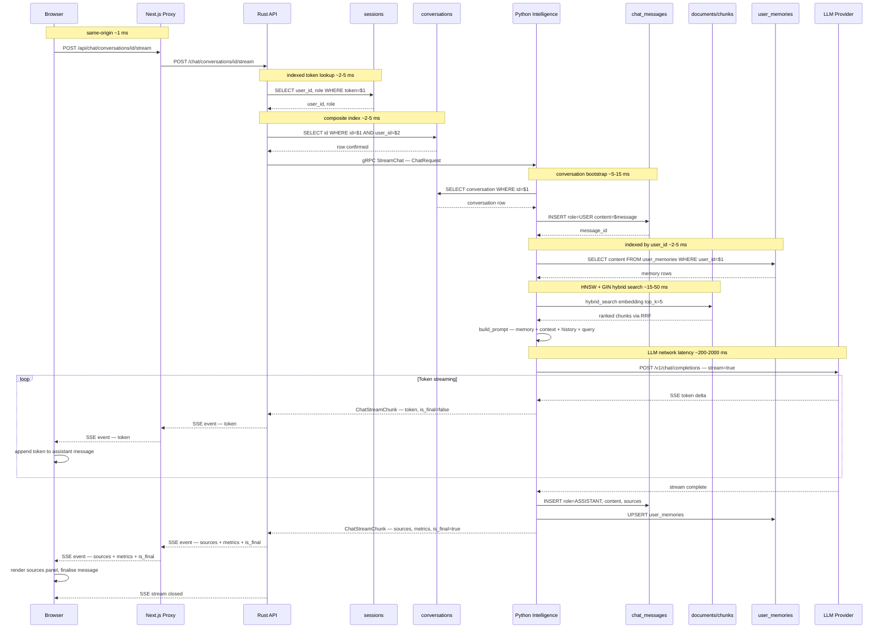
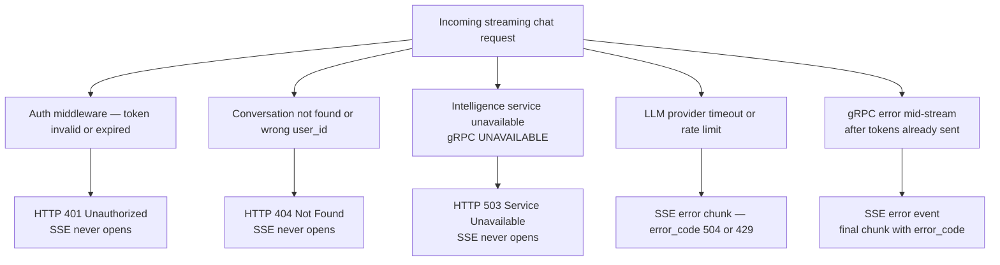

# Chat Message: End-to-End Runtime Flow

This page traces a single streaming chat message from the browser click to the last token rendered on screen, annotating each hop with DB queries, latency expectations, and failure modes.

## Full Sequence Diagram



## DB Query Count Per Request

| Service | Query | Purpose |
|---------|-------|---------|
| Rust #1 | `sessions` | Authentication + role resolution |
| Rust #2 | `conversations` | Ownership verification |
| Python #1 | `conversations` | gRPC-side ownership (redundant by design) |
| Python #2 | `chat_messages` INSERT | Persisting user message |
| Python #3 | `user_memories` SELECT | Loading user context |
| Python #4 | `hybrid_search()` | Vector + full-text retrieval |
| Python #5 | `chat_messages` INSERT | Persisting assistant message |
| Python #6 | `user_memories` UPSERT | Updating user memory |

**Total**: 2 Rust queries + 6 Python queries = **8 DB round-trips per streaming chat message**

This is the steady-state count. First message in a new conversation adds one INSERT for the conversation row.

## Latency Budget

| Segment | Typical | Worst Case |
|---------|---------|-----------|
| Browser → Next.js proxy | &lt;1 ms | 1 ms |
| auth_middleware DB lookup | 2–5 ms | 20 ms |
| Ownership check DB lookup | 2–5 ms | 20 ms |
| gRPC channel (tonic) | 0.5 ms | 2 ms |
| Python conversation + save | 5–15 ms | 50 ms |
| Memory retrieval | 2–5 ms | 20 ms |
| Hybrid search (HNSW + GIN) | 15–50 ms | 200 ms |
| Prompt construction | &lt;1 ms | 1 ms |
| **Time to first token** | **~30–90 ms** | **~300 ms** |
| Per-token delivery (LLM) | 20–50 ms | 200 ms |
| Post-generation saves | 5–10 ms | 50 ms |

## Failure Modes



**SSE error handling in browser**: The chat store listens for SSE `error` events via `EventSource.onerror`. Mid-stream errors append an error token to the assistant message and set `state.error` in the Zustand chat store.

## Rust → Python Data Fidelity

The Rust API passes `user_id` and `conversation_id` as plain strings — no type or ownership validation occurs in the Protobuf layer. Python performs its own `SELECT` to validate ownership against the `conversations` table, creating a **duplicate ownership check** across the language boundary. This is intentional defensive programming: the Python service cannot trust that all future callers will have performed the same validation.

However, there is a subtle inconsistency: the `conversations.user_id` column is `VARCHAR` without a foreign key to `users.id`. Python can insert conversations for users that do not exist in the `users` table. If such a "ghost" conversation is ever retrieved, the Rust API's JOIN with `users` will find no matching row and the conversation will be silently omitted from list results.

## Token Streaming from Browser's Perspective

```typescript
// client/web/components/ai-elements/chat-area/index.tsx (simplified)
const eventSource = new EventSource(`/api/chat/conversations/${id}/stream`, {
  // fetch-based SSE with POST body
});

eventSource.onmessage = (event) => {
  const chunk: ChatStreamChunk = JSON.parse(event.data);
  if (chunk.token) {
    appendToken(chunk.token);
  }
  if (chunk.is_final) {
    setSources(chunk.sources);
    setMetrics(chunk.metrics);
    eventSource.close();
  }
};

eventSource.addEventListener('error', () => {
  setError('Stream interrupted');
  eventSource.close();
});
```

The Zustand `chat-store.ts` manages the `streamingMessageId` state — while a message is streaming, the store marks it with a dedicated ID. When `is_final` arrives, the store transitions the message from streaming to complete, triggering re-render with the full message content and sources.
